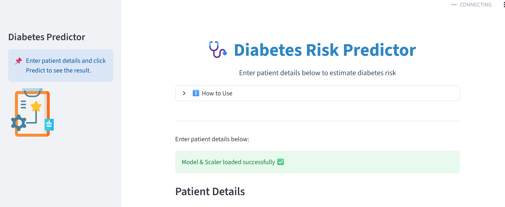
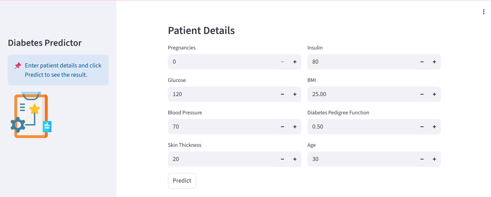
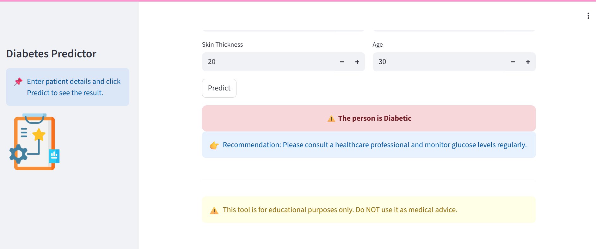

 🩺 Diabetes Prediction App

<div align="center">


</div>

---

 🌟 Overview

The **Diabetes Prediction App** predicts the likelihood of diabetes in a person using health parameters.
It’s powered by a **machine learning model** and has a **friendly Streamlit interface** for quick predictions.

Key Features:

* Fast diabetes risk assessment
* Clean, minimal interface
* Works locally or via Hugging Face Spaces
* Optional Docker deployment

---
 🚀 Live Demo

Check the live app here: [Hugging Face Demo](https://huggingface.co/spaces/laila123younas/diabetes-prediction-app)

---

 ## 📸 App Preview

### 🖥️ Main UI Screen


### 🧾 Input Form Screen


### 📊 Prediction Result Screen


---

🔹 Features

* Predict diabetes risk based on user input
* Preprocessing using `scaler.pkl`
* Lightweight, easy to deploy locally or on the cloud
* Optional Docker support

---

 Installation (Local Deployment)
 1. Clone the repo

```bash
git clone <your-repo-link>
cd <your-repo-folder>
```

 2. Create a virtual environment

```bash
python -m venv venv
# Activate:
# Linux / Mac
source venv/bin/activate
# Windows
venv\Scripts\activate
```
 3. Install dependencies

```bash
pip install -r requirements.txt
```

 4. Run the app

```bash
streamlit run app.py
```

* **Local URL:** [http://localhost:8501](http://localhost:8501)
* **Network URL:** [http://192.168.18.86:8501](http://192.168.18.86:8501)

---

☁️ Hugging Face Deployment

1. Create a new Space on [Hugging Face](https://huggingface.co/spaces) using **Streamlit**.
2. Upload project files:

   * `app.py`
   * `diabetes_model.pkl`
   * `scaler.pkl`
   * `requirements.txt`
   * Optional: `assets/` folder for GIFs/screenshots
3. Hugging Face installs dependencies and hosts the app automatically.
4. Live demo: [https://huggingface.co/spaces/laila123younas/diabetes-prediction-app](https://huggingface.co/spaces/laila123younas/diabetes-prediction-app)

---

🐳 Docker Deployment (Optional)

```bash
# Build Docker image
docker build -t diabetes-prediction-app .

# Run container
docker run -p 8501:8501 diabetes-prediction-app
```

Visit `http://localhost:8501` to access the app.

---

 📂 Project Structure

```plaintext
diabetes-prediction-app/
│
├── app.py                 # Streamlit app
├── diabetes_model.pkl     # Trained ML model
├── scaler.pkl             # Preprocessing scaler
├── requirements.txt       # Dependencies
├── Dockerfile             # Optional Docker setup
├── README.md              # Documentation
├── .gitignore             # Git ignore rules
└── assets/                # <-- Screenshots or GIFs go here
    └── demo.gif           # <-- Example GIF
```

---

 🛠 Technologies Used

* Python – Programming language
* Streamlit – Web interface
* scikit-learn – Machine learning
* NumPy & Pandas – Data processing
* Docker – Optional deployment
* Hugging Face Spaces – Cloud hosting

---

 🤝 Contributing

Contributions are welcome!

1. Fork the repo
2. Create a branch (`git checkout -b feature-name`)
3. Commit changes (`git commit -m "Add feature"`)
4. Push (`git push origin feature-name`)
5. Open a Pull Request

---
